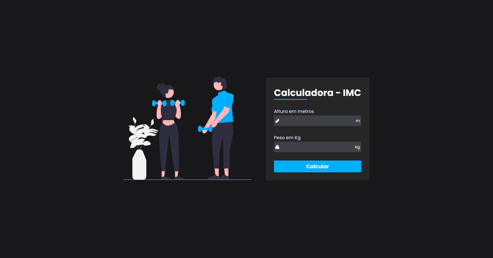
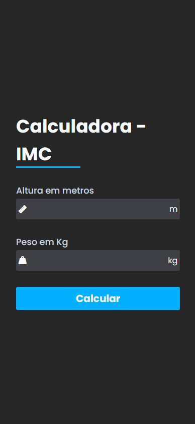
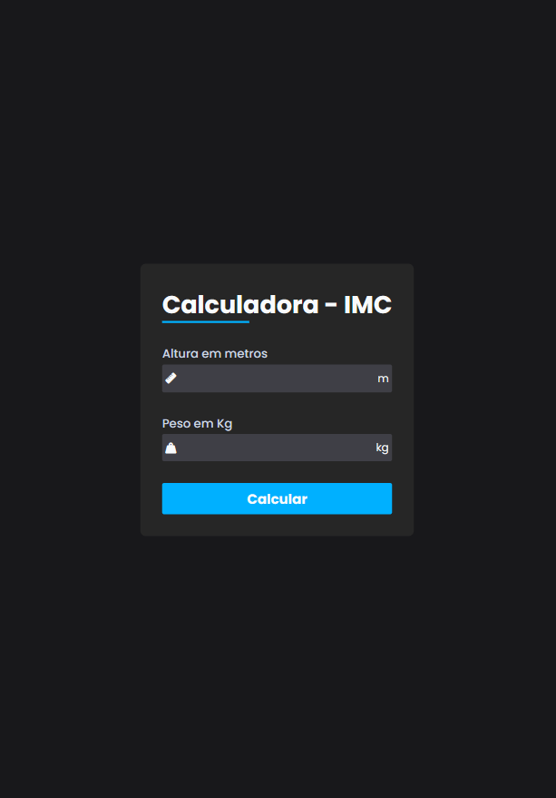
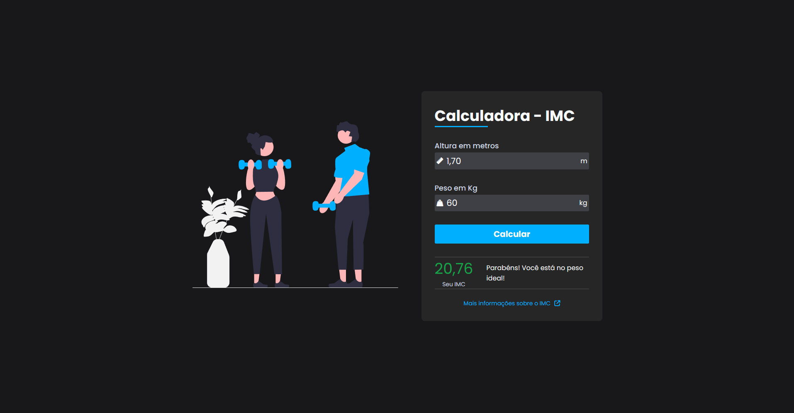
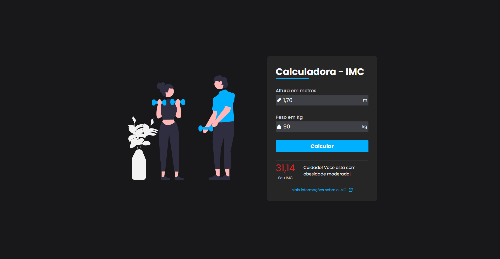

<h1 align="center"> Calculadora simples de IMC</h1>

  

 

## 👉🏻 Projeto

Esta é uma página simples que faz o cálculo do seu Índice de Massa Corporal.
Este projeto foi baseado no vídeo de <a href="https://github.com/Larissakich">Larissa Kich</a> no Youtube.

## 👉🏻 Tecnologias

Esse projeto foi desenvolvido com as seguintes tecnologias:

- HTML e CSS
- JavaScript
- Git e Github
- Flexbox

## 👉🏻 Preview site

- [Clique aqui](https://nicoledpizetta.github.io/bmi-calculator)

## 👉🏻 Screenshots

#### Desktop

#### Mobile

#### Tablet

#### Alguns resultados

## 👉🏻 Recursos úteis

- [Assistir ao vídeo de Larissa Kich](https://www.youtube.com/watch?v=GK0ok3ZCXwM&list=PLlhPWsetD9-otvR1UYWZBzP8JzPn3OlO2&index=21&ab_channel=LarissaKich)

## :memo: Licença

Esse projeto está sob a licença MIT.

---

 Feito com ♥ por <a href="https://github.com/NicoleDPizetta">Nicole Dalzotto Pizetta</a> 

---
